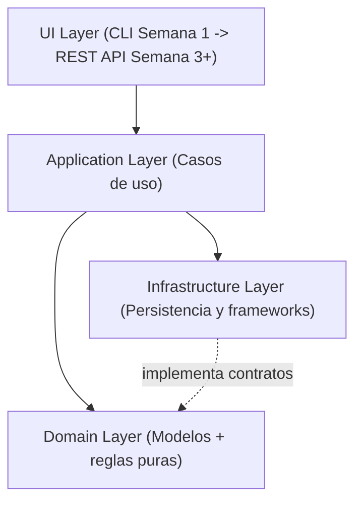

# Arquitectura OpsBackend

Monolito en capas con dominio desacoplado de frameworks.

```mermaid
flowchart TD
UI["UI Layer (CLI Semana 1 -> REST API Semana 3+)"] --> APP["Application Layer (Casos de uso)"]
APP --> DOM["Domain Layer (Modelos + reglas puras)"]
APP --> INF["Infrastructure Layer (Persistencia y frameworks)"]
INF -. "implementa contratos" .-> DOM
```

